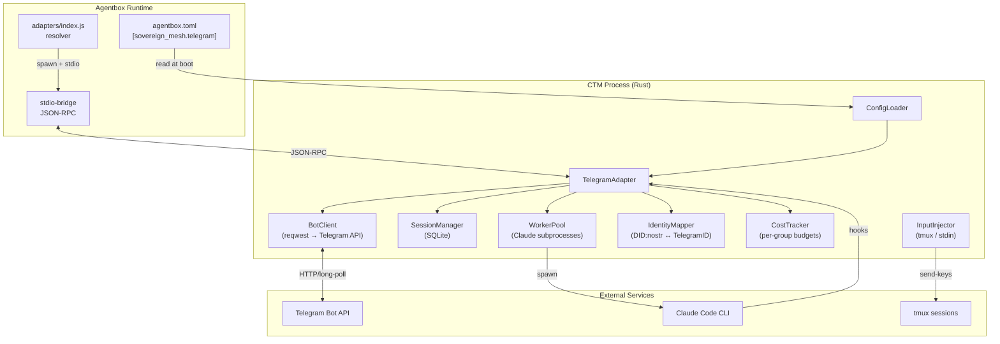
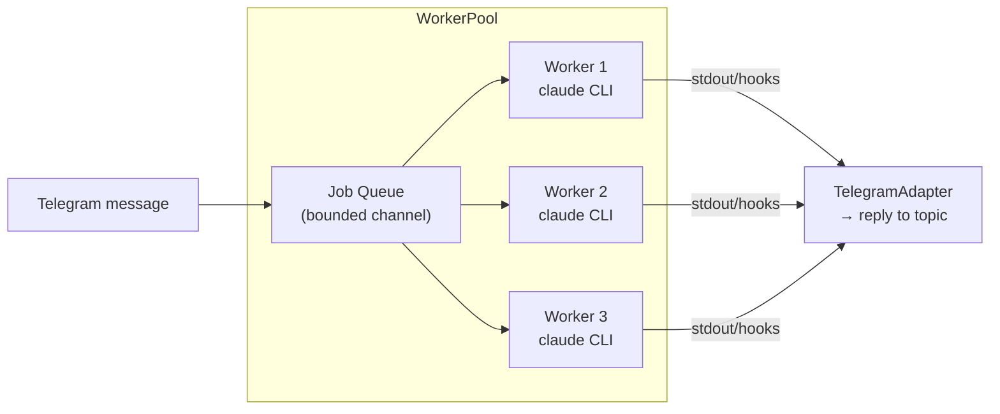

# ADR-007: Agentbox adapter integration for Telegram bridge

**Status:** Accepted
**Date:** 2026-05-05
**Author:** Architecture Agent (SPARC)
**Related:** agentbox ADR-005 (pluggable adapter architecture), agentbox PRD-001 (capabilities and adapters), CTM ADR-013 (sub-agent routing)

## Context

Claude Telegram Mirror (CTM) is a Rust binary (`ctm` crate, v0.3.0) that bidirectionally mirrors Claude Code sessions to Telegram forum topics. It currently operates as a standalone daemon with hardcoded `config.json` credentials, a SQLite session store, and Unix domain socket IPC to Claude Code hook processes.

Agentbox is migrating to a five-slot pluggable adapter architecture (ADR-005) with slots for beads, pods, memory, events, and orchestrator. Each slot resolves at boot to one of three implementation classes: `local-*`, `external`, or `off`. The events slot contract defines three methods: `dispatch(event)`, `subscribe(filter, handler)`, and `unsubscribe(subscriptionId)`.

The integration must solve several problems simultaneously:

1. **Configuration convergence.** CTM reads `~/.config/claude-telegram-mirror/config.json` with env var overlay. Agentbox reads `agentbox.toml` with env var overlay. Two config systems for the same deployment is a maintenance liability.

2. **Identity mapping.** Agentbox uses `did:nostr:<hex-pubkey>` for operator identity. Telegram uses numeric user IDs and bot tokens. The bridge must map between these identity systems for RBAC.

3. **Event contract compliance.** CTM already emits structured events (session lifecycle, tool use, agent responses) over Unix sockets. These events must flow through the agentbox events adapter contract without losing fidelity.

4. **Multi-user scaling.** The current CTM supports a single operator (one `chat_id`). The jedarden/telegram-claude-bridge reference implementation demonstrates per-group configuration, worker pools, budget enforcement, and 30+ bot commands. The architecture must accommodate this scaling without breaking the adapter contract.

5. **Process model.** CTM currently runs as a standalone daemon. Under agentbox, it must be embeddable as a library crate that the agentbox orchestrator can manage, while retaining the ability to run standalone for non-agentbox deployments.

## Decision

### Dual-mode crate architecture

The `ctm` crate retains its existing `lib.rs` + `main.rs` structure. A new `adapter` module provides the agentbox integration surface. The binary remains standalone-capable. When running under agentbox, the adapter module is the entry point.

```
ctm/src/
  lib.rs              # existing public API
  main.rs             # standalone binary entry point
  adapter/
    mod.rs            # TelegramEventsAdapter (implements events slot contract)
    config_loader.rs  # agentbox.toml [sovereign_mesh.telegram] parser
    identity.rs       # DID:nostr <-> Telegram ID mapper
    worker_pool.rs    # Claude subprocess worker pool
    cost_tracker.rs   # Per-group budget enforcement
```

### Events adapter implementation

CTM implements the agentbox events adapter contract as a Rust-native adapter. The management API's JavaScript resolver gains a new `events` implementation value: `"telegram-bridge"`. At boot, this adapter:

1. Loads config from `agentbox.toml` `[sovereign_mesh.telegram]` with env overlay
2. Initializes the Telegram bot client
3. Starts the session manager with SQLite backing
4. Registers event subscriptions for Claude session lifecycle events
5. Exposes `dispatch()`, `subscribe()`, and `unsubscribe()` via a JSON-RPC stdio bridge

The stdio bridge pattern matches the orchestrator slot's `stdio-bridge` precedent: agentbox's JS management API communicates with the Rust process over stdin/stdout JSON-RPC, avoiding FFI complexity.

### Component architecture



### Configuration model

```toml
# agentbox.toml
[adapters]
events = "telegram-bridge"    # new impl value

[sovereign_mesh.telegram]
enabled = true
bot_token_env = "TELEGRAM_BOT_TOKEN"   # env var name, not the value
chat_id = -1001234567890               # primary supergroup

# Per-group overrides (multi-user)
[[sovereign_mesh.telegram.groups]]
chat_id = -1001234567890
name = "ops-team"
model = "claude-sonnet-4-20250514"
budget_usd = 50.0
budget_period = "monthly"
cwd = "/home/devuser/workspace/project"
allowed_tools = ["Read", "Bash", "Edit", "Write", "Grep", "Glob"]
max_concurrent_workers = 3

[[sovereign_mesh.telegram.groups]]
chat_id = -1009876543210
name = "research-team"
model = "claude-sonnet-4-20250514"
budget_usd = 20.0
budget_period = "weekly"

[sovereign_mesh.telegram.identity]
# Maps operator DID:nostr pubkey to Telegram user IDs for RBAC
admin_telegram_ids = [123456789]       # full control
user_telegram_ids = [987654321]        # restricted commands

[sovereign_mesh.telegram.rate_limits]
messages_per_second = 20               # Telegram global rate limit
chunk_size = 4000                      # max chars per message
session_timeout_minutes = 30

[sovereign_mesh.telegram.cleanup]
auto_delete_topics = true
topic_delete_delay_minutes = 15
inactivity_threshold_minutes = 720
stale_session_hours = 72
```

Environment variables overlay every config field with `TELEGRAM_` prefix, preserving backward compatibility with existing CTM deployments. The `bot_token_env` indirection prevents secrets from appearing in `agentbox.toml`.

### Identity mapping

The `IdentityMapper` maintains a bidirectional map between `did:nostr:<hex-pubkey>` and Telegram user IDs. The operator pubkey from `[sovereign_mesh.operator].pubkey_hex` is the root admin. Additional mappings are declared in `[sovereign_mesh.telegram.identity]`.

RBAC roles:

| Role | Source | Capabilities |
|------|--------|-------------|
| `admin` | Operator pubkey's mapped Telegram IDs | All commands, config changes, budget overrides |
| `user` | Declared user Telegram IDs | Send prompts, view sessions, limited slash commands |
| `observer` | Group members not in either list | Read-only mirror, no interaction |

### Worker pool for Claude invocations

The `WorkerPool` manages Claude CLI subprocess lifecycles. Each group can have up to `max_concurrent_workers` parallel Claude invocations. Workers are spawned via `claude --dangerously-skip-permissions` (or configured permission mode) with the group's CWD and model.



Workers have a configurable idle timeout. When a session is inactive beyond `session_timeout_minutes`, the worker is reclaimed. Cost tracking is per-worker, aggregated per-group, enforced per-budget-period.

### Event flow through the adapter contract

The events adapter contract has three methods. Here is how CTM implements each:

**`dispatch(event)`** — Receives events from agentbox internals (agent spawned, bead claimed, etc.) and forwards them to the appropriate Telegram topic. The `event.kind` field maps to CTM's `MessageType` enum. Events with `session_id` are routed to the session's forum topic; events without are sent to the primary group.

**`subscribe(filter, handler)`** — Registers a handler that receives Telegram-originated events (user messages, commands, approval responses) as agentbox events. The filter supports `kind` matching. Subscription IDs follow the `urn:agentbox:event:*` grammar.

**`unsubscribe(subscriptionId)`** — Removes a handler. Used during graceful shutdown and session cleanup.

### Backward compatibility

The standalone `ctm` binary remains fully functional without agentbox. The `adapter` module is feature-gated:

```toml
# ctm Cargo.toml
[features]
default = []
agentbox = []   # enables adapter module compilation
```

When the `agentbox` feature is not active, `adapter/` is not compiled. The existing `config.rs` loading path (`config.json` + env vars) is unchanged. When running under agentbox, `ConfigLoader` reads `agentbox.toml` first, then falls back to the legacy path for any unset fields.

### Stdio bridge protocol

The JSON-RPC protocol between agentbox's JS runtime and the CTM Rust process:

```json
// agentbox -> CTM: dispatch event
{"jsonrpc": "2.0", "id": 1, "method": "dispatch", "params": {"kind": "agent.spawned", "session_id": "sess-abc", "payload": {"agent_type": "researcher"}}}

// CTM -> agentbox: dispatch result
{"jsonrpc": "2.0", "id": 1, "result": {"ts": "2026-05-05T12:00:00Z", "kind": "agent.spawned"}}

// agentbox -> CTM: subscribe
{"jsonrpc": "2.0", "id": 2, "method": "subscribe", "params": {"filter": {"kind": "user.message"}}}

// CTM -> agentbox: subscription ID
{"jsonrpc": "2.0", "id": 2, "result": {"subscription_id": "urn:agentbox:event:abc123"}}

// CTM -> agentbox: subscription notification (no id = notification)
{"jsonrpc": "2.0", "method": "event", "params": {"subscription_id": "urn:agentbox:event:abc123", "event": {"ts": "...", "kind": "user.message", "session_id": "sess-abc", "payload": {"text": "fix the bug", "telegram_user_id": 123456789}}}}
```

### Health and observability

The adapter exposes `/health` status via the stdio bridge:

```json
{"jsonrpc": "2.0", "id": 99, "method": "health"}
// Response: {"jsonrpc": "2.0", "id": 99, "result": {"status": "healthy", "bot_connected": true, "active_sessions": 3, "active_workers": 2, "uptime_secs": 3600}}
```

Metrics are emitted as structured logs (compatible with agentbox's pino+OTel pipeline):

- `ctm_events_dispatched_total{kind, outcome}`
- `ctm_telegram_messages_sent_total{chat_id}`
- `ctm_telegram_rate_limit_hits_total`
- `ctm_workers_active{group}`
- `ctm_cost_usd{group, period}`
- `ctm_sessions_active`

## Consequences

### Positive

1. **Single config source.** Operators configure Telegram bridging in `agentbox.toml` alongside all other adapter settings. No separate `config.json` to manage.

2. **Identity coherence.** The `did:nostr` operator identity maps cleanly to Telegram RBAC, using the same pubkey that governs pod ACLs and relay allowlists.

3. **Contract compliance.** The events adapter contract (`dispatch`/`subscribe`/`unsubscribe`) maps naturally to CTM's existing event flow. No impedance mismatch.

4. **Standalone preservation.** The feature gate ensures non-agentbox users are unaffected. The `ctm` binary works exactly as before.

5. **Multi-user scaling.** Per-group configuration, worker pools, and budget enforcement are first-class concerns in the config model, not bolted on.

6. **Process isolation.** The stdio bridge keeps Rust and JS in separate processes. No FFI, no shared memory, no ABI coupling. Either side can crash without taking the other down.

### Negative

1. **Stdio latency.** JSON-RPC over stdio adds ~1-5ms per round-trip compared to in-process function calls. Acceptable for event dispatch (SLO: 50ms p95) but worth monitoring.

2. **Two process model.** The agentbox management API and CTM are separate processes. Debugging cross-process issues requires correlated logs (addressed by shared `session_id` and `execution_id` in every event).

3. **Feature gate maintenance.** The `agentbox` feature gate adds conditional compilation complexity. Both paths must be tested in CI.

4. **Config migration burden.** Existing CTM users who adopt agentbox must migrate from `config.json` to `agentbox.toml`. The fallback path eases this but does not eliminate it.

### Neutral

1. **SQLite remains the session store.** The adapter does not migrate sessions to agentbox's beads slot. Sessions are a Telegram-specific concern (thread IDs, topic colors, approval states) that do not map cleanly to the bead epic/child/claim/close model. If session durability across container restarts becomes a requirement, a future ADR can address migration to the pods slot.

2. **Bot token handling is unchanged.** The token is still read from an environment variable. `agentbox.toml` stores the env var name, not the value. This matches agentbox's existing pattern for `OPERATOR_NOSTR_PRIVKEY`.

## Alternatives considered

### A1: In-process FFI adapter (Rust compiled to cdylib, loaded by Node.js via napi-rs)

Rejected. FFI introduces ABI coupling, crash propagation, and build complexity (napi-rs toolchain in the Nix flake). The latency benefit (~0.1ms vs ~2ms for stdio) does not justify the coupling risk for an event dispatch SLO of 50ms.

### A2: HTTP adapter (CTM exposes REST API, agentbox calls it like `events/external`)

Rejected. Would require CTM to run an HTTP server alongside its existing socket server, adding attack surface. The existing `events/external.js` adapter already covers HTTP POST sinks. CTM is not a generic HTTP event sink -- it is a Telegram-specific bridge with bidirectional state (sessions, topics, approvals). The stdio bridge preserves the bidirectional subscription model that HTTP POST cannot.

### A3: Rewrite CTM in JavaScript as an agentbox-native events adapter

Rejected. CTM is 9,100+ lines of production Rust with 12 documented bug fixes, rate limiting, session management, and approval workflows. Rewriting discards battle-tested code. The Rust crate's type safety and error handling (thiserror, no panics on untrusted data) are strengths worth preserving.

### A4: MCP tool adapter (CTM as an MCP server consumed by agentbox)

Considered for future work. MCP's tool/resource model could expose Telegram as a tool (`send_message`, `create_topic`, `get_sessions`). This complements but does not replace the events adapter -- MCP is request/response, while events are pub/sub. A future ADR may add MCP tool support alongside the events adapter.

### A5: Nostr relay bridge (CTM subscribes to agentbox's embedded relay for events)

Considered for future work. The `[sovereign_mesh.relay]` already supports event kinds. CTM could subscribe to kind 38000 (agent events) and publish kind 1 (notes) for Telegram messages. This would eliminate the stdio bridge but requires NIP-42 auth, event signing, and relay connection management. Viable as a v2 evolution once the relay infrastructure stabilizes.
