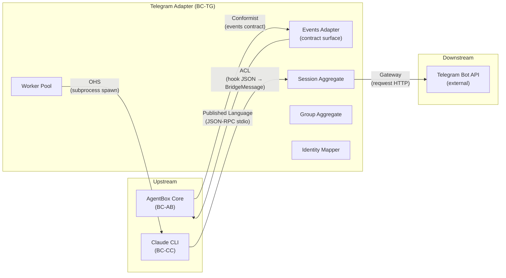
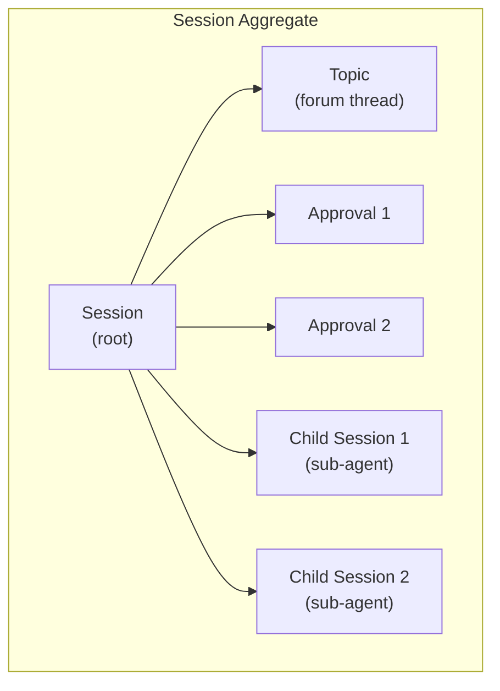
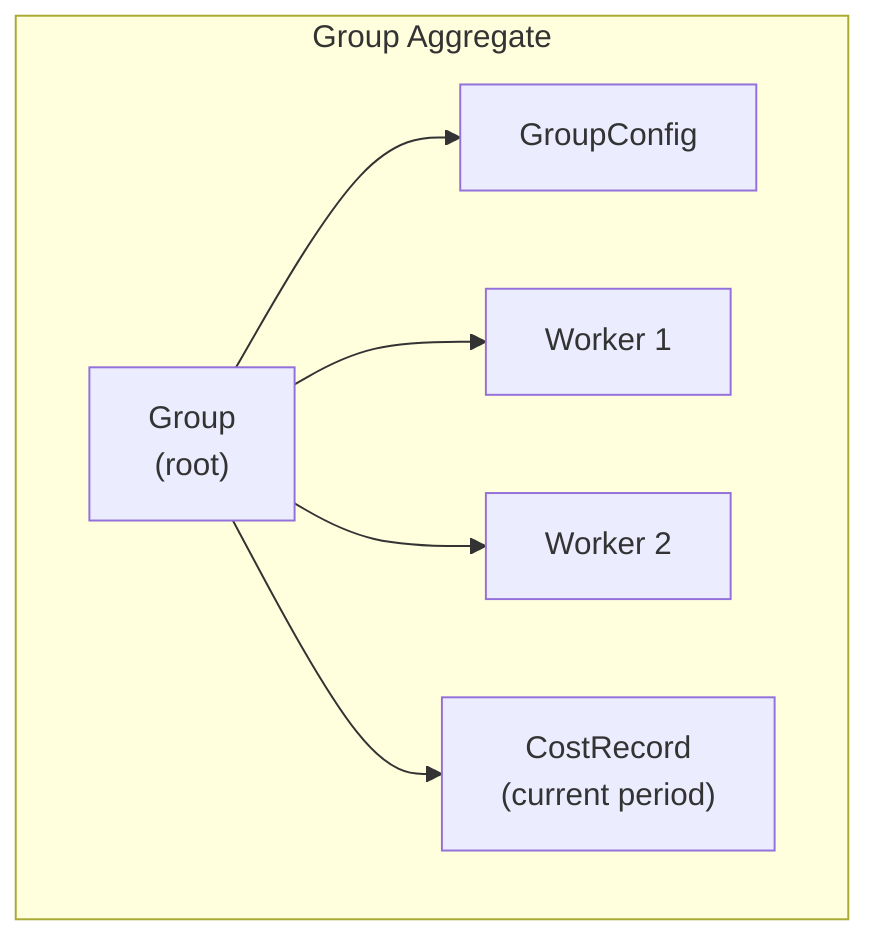
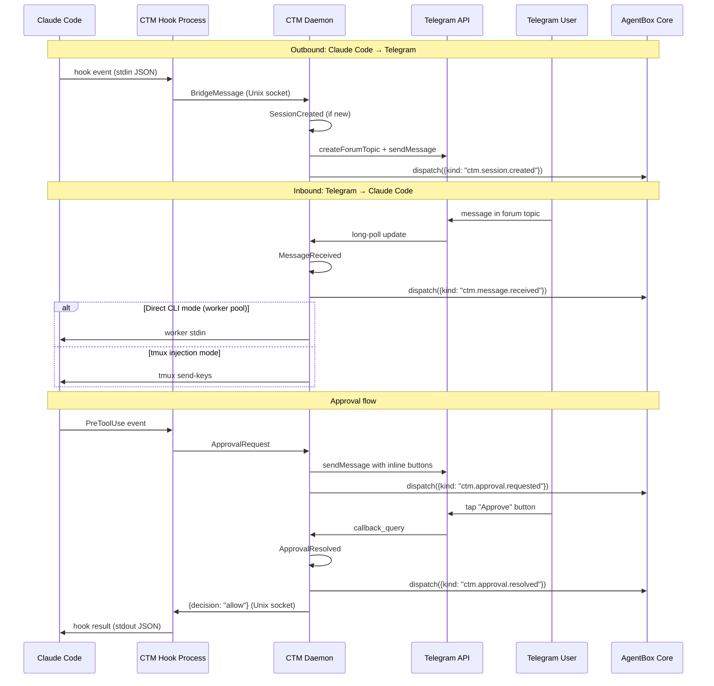
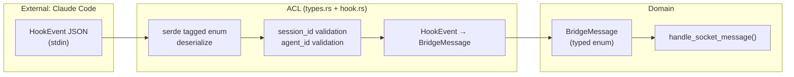

# Bounded Context: Telegram Adapter

**Context name:** Telegram Adapter (BC-TG)
**Owner:** CTM crate (`ctm` v0.3.0+)
**Upstream contexts:** AgentBox Core (BC-AB), Claude CLI (BC-CC)
**Downstream contexts:** Telegram Bot API (external)
**Related ADR:** [ADR-001](../adr/ADR-001-agentbox-adapter-integration.md)

## Purpose

The Telegram Adapter bounded context is responsible for bidirectional bridging between agentbox agent lifecycle events and Telegram forum conversations. It receives structured events from the agentbox events adapter contract, renders them as Telegram messages in forum topics, and converts Telegram user interactions back into agentbox events and Claude CLI inputs.

This context owns the Telegram-specific domain: bot sessions, forum topics, message formatting, rate limiting, approval workflows, and the mapping between agentbox's `did:nostr` identity and Telegram's numeric user IDs.

## Context map



### Relationship types

| Upstream | Relationship | Description |
|----------|-------------|-------------|
| AgentBox Core | **Conformist** | BC-TG implements the events adapter contract exactly as defined by ADR-005. No negotiation -- the contract is non-negotiable. |
| Claude CLI | **Anti-Corruption Layer** | Hook events arrive as freeform JSON via Unix socket or stdin. The ACL (`types.rs` + `hook.rs`) deserializes them into strongly-typed `HookEvent` variants before they enter the domain. Unknown fields are silently dropped; unknown event types deserialize to safe defaults. |

| Downstream | Relationship | Description |
|-----------|-------------|-------------|
| Telegram Bot API | **Gateway** | All Telegram API calls go through `BotClient`, which handles rate limiting (governor), retry with exponential backoff, chunk splitting, and error translation. The domain never constructs raw HTTP requests. |
| AgentBox Core (events) | **Published Language** | BC-TG publishes events back to agentbox using the JSON-RPC stdio protocol defined in ADR-001. Event payloads use the `{ ts, kind, session_id, payload }` schema from the events adapter contract. |

## Ubiquitous language

| Term | Definition |
|------|-----------|
| **Session** | A Claude Code session being mirrored to Telegram. Has a lifecycle (active/ended/aborted), a forum topic, optional tmux target, and zero or more child sessions (sub-agents). |
| **Group** | A Telegram supergroup/forum with its own configuration (model, budget, CWD, tool restrictions, worker limit). The unit of multi-tenancy. |
| **Worker** | A Claude CLI subprocess managed by the worker pool. Bound to a group's CWD and model. Has an idle timeout and cost accumulator. |
| **Topic** | A Telegram forum topic (thread) representing one session. Created lazily on first message. Auto-deleted after inactivity. Color-coded by session ID hash. |
| **Bridge Message** | The internal wire format for events flowing between Claude Code hooks and the daemon. Typed by `MessageType` enum (15 variants + `Unknown` catch-all). |
| **Approval** | A pending tool-use authorization request. Created when Claude requests permission for a sensitive tool. Expires after a configurable timeout. Resolved by Telegram inline button tap. |
| **Identity Binding** | A mapping between a `did:nostr:<hex-pubkey>` and one or more Telegram user IDs. Determines RBAC role (admin/user/observer). |
| **Cost Record** | Accumulated API cost for a worker within a budget period. Tracks input tokens, output tokens, and USD equivalent. |
| **Topic Color** | One of six Telegram forum topic icon colors. Deterministically assigned from a hash of the session ID for visual distinction. |

## Entities

### User

The human operator or team member interacting through Telegram.

```rust
/// An authenticated user with both Telegram and DID:nostr identity.
struct User {
    /// Telegram numeric user ID (stable across username changes).
    telegram_id: i64,
    /// Optional DID:nostr identity. Present when the Telegram ID is mapped
    /// to an operator pubkey via [sovereign_mesh.telegram.identity].
    did_nostr: Option<String>,
    /// Display name from Telegram profile (informational, not authoritative).
    display_name: String,
    /// RBAC role resolved from identity config.
    role: UserRole,
}

enum UserRole {
    /// Operator pubkey holder. All commands, config changes, budget overrides.
    Admin,
    /// Declared user. Send prompts, view sessions, limited slash commands.
    User,
    /// Group member not in identity config. Read-only mirror view.
    Observer,
}
```

**Invariants:**
- I1: A `telegram_id` maps to at most one `did_nostr` identity.
- I2: The operator's `pubkey_hex` from `[sovereign_mesh.operator]` always resolves to `Admin` role.
- I3: Role resolution is deterministic: admin list checked first, then user list, then fallback to observer.

### Session

The core domain entity representing a mirrored Claude Code session.

```rust
struct Session {
    /// Claude Code session ID (alphanumeric + hyphens + underscores + dots).
    id: SessionId,
    /// Telegram chat ID of the group this session belongs to.
    chat_id: i64,
    /// Telegram forum topic (thread) ID. None until first message triggers creation.
    thread_id: Option<i64>,
    /// Hostname of the machine running Claude Code.
    hostname: Option<String>,
    /// tmux target pane for input injection.
    tmux_target: Option<String>,
    /// tmux socket path (for non-default tmux servers).
    tmux_socket: Option<String>,
    /// Session lifecycle status.
    status: SessionStatus,
    /// Working directory of the Claude Code session.
    project_dir: Option<String>,
    /// Parent session ID for sub-agent sessions (ADR-013).
    parent_session_id: Option<SessionId>,
    /// Agent ID for sub-agent sessions.
    agent_id: Option<String>,
    /// Agent type label for sub-agent sessions.
    agent_type: Option<String>,
    /// ISO 8601 timestamp of session start.
    started_at: Timestamp,
    /// ISO 8601 timestamp of last activity.
    last_activity: Timestamp,
}

enum SessionStatus { Active, Ended, Aborted }
```

**Invariants:**
- I4: `id` matches `^[a-zA-Z0-9._-]{1,128}$`.
- I5: A session transitions only: `Active -> Ended`, `Active -> Aborted`, or `Ended/Aborted -> Active` (reactivation on resumed hook events).
- I6: `thread_id` is set at most once per active lifecycle. If the topic is deleted, `thread_id` is cleared and a new topic is created on next activity.
- I7: Sub-agent sessions (`parent_session_id` is Some) cascade end when the parent session ends.
- I8: `last_activity` is updated on every inbound event for this session.

### Group

A Telegram supergroup with per-group operational configuration.

```rust
struct Group {
    /// Telegram chat ID (negative number for supergroups).
    chat_id: i64,
    /// Human-readable name for logging and display.
    name: String,
    /// Configuration for Claude invocations in this group.
    config: GroupConfig,
    /// Active worker count (derived from worker pool state).
    active_workers: usize,
    /// Accumulated cost for current budget period.
    current_period_cost: CostRecord,
}

struct GroupConfig {
    /// Claude model to use for this group's sessions.
    model: String,
    /// Budget cap in USD for the budget period.
    budget_usd: f64,
    /// Budget period (monthly, weekly, daily).
    budget_period: BudgetPeriod,
    /// Working directory for Claude invocations.
    cwd: PathBuf,
    /// Allowed tools (empty = all tools allowed).
    allowed_tools: Vec<String>,
    /// Maximum concurrent Claude workers.
    max_concurrent_workers: usize,
}

enum BudgetPeriod { Daily, Weekly, Monthly }
```

**Invariants:**
- I9: `budget_usd >= 0.0`. A budget of 0.0 disables new Claude invocations.
- I10: `max_concurrent_workers >= 1` and `<= 10` (hard cap to prevent resource exhaustion).
- I11: A group's `current_period_cost` resets to zero when the budget period rolls over.
- I12: When `current_period_cost.total_usd >= budget_usd`, new worker spawns are rejected and a `BudgetExceeded` event is emitted.

### Worker

A managed Claude CLI subprocess.

```rust
struct Worker {
    /// Unique worker ID.
    id: WorkerId,
    /// Group this worker belongs to.
    group_chat_id: i64,
    /// Session this worker is serving.
    session_id: SessionId,
    /// Claude CLI child process handle.
    process: tokio::process::Child,
    /// Worker lifecycle status.
    status: WorkerStatus,
    /// Accumulated cost for this worker's lifetime.
    cost: CostRecord,
    /// Timestamp when the worker was spawned.
    spawned_at: Timestamp,
    /// Timestamp of last I/O activity.
    last_activity: Timestamp,
}

enum WorkerStatus {
    /// Running and processing prompts.
    Active,
    /// Idle, waiting for next prompt. Subject to idle timeout reclaim.
    Idle,
    /// Shutting down gracefully (SIGTERM sent, waiting for exit).
    Draining,
    /// Process has exited.
    Exited { code: Option<i32> },
}
```

**Invariants:**
- I13: A worker is always associated with exactly one group and one session.
- I14: Worker count per group never exceeds `group.config.max_concurrent_workers`.
- I15: An idle worker is reclaimed after `session_timeout_minutes` of no activity.
- I16: On reclaim or exit, the worker's cost is finalized and added to the group's period total.

## Value objects

### MessageContent

Immutable representation of a message's content, independent of transport.

```rust
enum MessageContent {
    /// Plain text or Markdown.
    Text { body: String, parse_mode: Option<ParseMode> },
    /// Tool execution summary (tool name, input preview, result preview).
    ToolExecution { tool: String, input_preview: String, result_preview: Option<String> },
    /// Approval request with inline action buttons.
    ApprovalRequest { prompt: String, approval_id: String, buttons: Vec<InlineButton> },
    /// Image or document attachment.
    Media { file_path: PathBuf, caption: Option<String>, media_type: MediaType },
    /// Session lifecycle announcement.
    SessionLifecycle { event_type: LifecycleType, details: String },
}

enum ParseMode { Markdown, MarkdownV2, Html }
enum MediaType { Photo, Audio, Video, Document }
enum LifecycleType { Started, Ended, Resumed, Compacting }
```

### BotCommand

A validated slash command from a Telegram user.

```rust
struct BotCommand {
    /// Command name without the leading slash.
    name: String,
    /// Arguments after the command name.
    args: String,
    /// Telegram user who issued the command.
    from: User,
    /// Thread ID where the command was issued (None = general topic).
    thread_id: Option<i64>,
}
```

**Validation rules:**
- V1: `name` matches `^[a-z_]{1,32}$` (Telegram bot command format).
- V2: Total command string (including args) is safe per `is_valid_slash_command()` whitelist: ASCII alphanumerics, underscores, hyphens, spaces, forward slashes only.
- V3: The issuing user's role must have permission for the command (see command permission matrix below).

### CostRecord

Accumulated API cost for a worker or group.

```rust
struct CostRecord {
    /// Total input tokens consumed.
    input_tokens: u64,
    /// Total output tokens consumed.
    output_tokens: u64,
    /// Total USD cost (computed from model pricing).
    total_usd: f64,
    /// Number of API calls.
    api_calls: u32,
    /// Period start timestamp.
    period_start: Timestamp,
}
```

### TopicColor

Deterministic color assignment for forum topics.

```rust
struct TopicColor(usize);

impl TopicColor {
    /// Compute from session ID. Deterministic: same session always gets same color.
    fn from_session_id(session_id: &str) -> Self {
        let hash = session_id.bytes().fold(0u32, |acc, b| acc.wrapping_add(b as u32));
        Self((hash as usize) % 6)
    }

    /// Telegram color ID (0x6FB9F0, 0xFFD67E, 0xCB86DB, 0x8EEE98, 0xFF93B2, 0xFB6F5F).
    fn telegram_color_id(&self) -> u32 {
        [0x6FB9F0, 0xFFD67E, 0xCB86DB, 0x8EEE98, 0xFF93B2, 0xFB6F5F][self.0]
    }
}
```

## Aggregates

### Session aggregate (root: Session)

The Session aggregate manages the lifecycle of a mirrored Claude Code session, including its forum topic, pending approvals, and child sessions.



**Aggregate boundary:**
- The Session is the aggregate root. All mutations to approvals and child session state go through the Session.
- Topic creation/deletion is an eventual operation (Telegram API call may fail). The session remains valid even if the topic does not exist yet.
- Approvals are owned by the session. When a session ends, all pending approvals are expired atomically (single SQLite transaction, see `end_session` in `session.rs`).

**Commands:**
- `CreateSession(id, chat_id, hostname, project_dir, tmux_target)` -- idempotent, returns existing session if already active
- `EndSession(id, status)` -- cascades to children, expires approvals
- `ReactivateSession(id)` -- transitions Ended/Aborted back to Active
- `CreateApproval(session_id, prompt, message_id)` -- returns approval ID
- `ResolveApproval(approval_id, decision)` -- updates status, notifies Claude CLI
- `SetTmuxTarget(session_id, target, socket)` -- updates input injection path
- `RenameSession(session_id, title)` -- updates topic name in Telegram

### Group aggregate (root: Group)

The Group aggregate manages per-group configuration, worker allocation, and budget enforcement.



**Aggregate boundary:**
- The Group is the aggregate root. Worker spawn/reclaim and cost accumulation go through the Group.
- GroupConfig is immutable after loading from `agentbox.toml`. Runtime changes require a config reload (no hot-patching).
- CostRecord is mutable and updated after every worker API call.

**Commands:**
- `SpawnWorker(group, session_id)` -- checks budget, checks worker cap, spawns Claude CLI
- `ReclaimWorker(worker_id)` -- graceful shutdown (SIGTERM, wait, SIGKILL)
- `AccumulateCost(worker_id, cost_delta)` -- updates worker and group cost records
- `ResetBudgetPeriod(group)` -- zeroes cost record when period rolls over
- `EnforceBudget(group)` -- checks current cost against cap, emits BudgetExceeded if exceeded

## Domain events

All events follow the agentbox events adapter schema: `{ ts, kind, session_id, execution_id, payload }`.

| Event | Kind string | Trigger | Payload |
|-------|-------------|---------|---------|
| **SessionCreated** | `ctm.session.created` | First message for a new session ID | `{ hostname, project_dir, chat_id, thread_id }` |
| **SessionEnded** | `ctm.session.ended` | Explicit session end or inactivity timeout | `{ reason, duration_secs, final_status }` |
| **SessionResumed** | `ctm.session.resumed` | Activity on a previously ended session | `{ previous_status, inactivity_secs }` |
| **TopicCreated** | `ctm.topic.created` | Forum topic created in Telegram | `{ thread_id, topic_name, color }` |
| **TopicDeleted** | `ctm.topic.deleted` | Forum topic auto-deleted after inactivity | `{ thread_id, inactivity_minutes }` |
| **MessageReceived** | `ctm.message.received` | User sends a message in a session topic | `{ telegram_user_id, text, thread_id, role }` |
| **MessageSent** | `ctm.message.sent` | Bridge sends a message to Telegram | `{ thread_id, message_type, chars }` |
| **ApprovalRequested** | `ctm.approval.requested` | Claude requests tool approval | `{ approval_id, tool_name, session_id }` |
| **ApprovalResolved** | `ctm.approval.resolved` | User taps approve/deny button | `{ approval_id, decision, resolved_by }` |
| **WorkerSpawned** | `ctm.worker.spawned` | Claude CLI subprocess started | `{ worker_id, group_chat_id, model, cwd }` |
| **WorkerExited** | `ctm.worker.exited` | Claude CLI subprocess terminated | `{ worker_id, exit_code, cost_usd, duration_secs }` |
| **BudgetExceeded** | `ctm.budget.exceeded` | Group's period cost exceeds budget cap | `{ group_chat_id, budget_usd, current_usd, period }` |
| **BudgetReset** | `ctm.budget.reset` | Budget period rolled over | `{ group_chat_id, previous_total_usd, period }` |
| **CommandExecuted** | `ctm.command.executed` | Bot slash command processed | `{ command, args, user_id, role, success }` |
| **RateLimited** | `ctm.rate_limited` | Telegram returned HTTP 429 | `{ retry_after_secs, queue_depth }` |
| **IdentityMapped** | `ctm.identity.mapped` | DID:nostr bound to Telegram ID | `{ did_nostr, telegram_id, role }` |

### Event flow diagram



## Command permission matrix

| Command | Admin | User | Observer |
|---------|-------|------|----------|
| `/start` | Y | Y | Y |
| `/help` | Y | Y | Y |
| `/status` | Y | Y | N |
| `/sessions` | Y | Y | N |
| `/attach <session>` | Y | Y | N |
| `/detach` | Y | Y | N |
| `/stop` | Y | Y | N |
| `/kill` | Y | N | N |
| `/clear` | Y | N | N |
| `/compact` | Y | Y | N |
| `/mute` / `/unmute` | Y | Y | N |
| `/toggle` | Y | N | N |
| `/rename <title>` | Y | Y | N |
| `/model <name>` | Y | N | N |
| `/budget [amount]` | Y | N | N |
| `/workers` | Y | Y | N |
| `/cost` | Y | Y | N |
| `/config` | Y | N | N |
| `/doctor` | Y | N | N |
| Send prompt text | Y | Y | N |
| Approve/deny buttons | Y | Y | N |

## Anti-corruption layer: Hook events to domain events

The ACL translates Claude Code hook events (freeform JSON from the Claude Code harness) into strongly-typed domain events. Translation is lossy by design -- unknown fields are dropped, unknown event types default to safe no-ops.



Translation rules:

| Hook Event | BridgeMessage Type | Notes |
|-----------|-------------------|-------|
| `Stop` | `SessionEnd` or `TurnComplete` | `SessionEnd` if `reason` is terminal; `TurnComplete` otherwise |
| `SubagentStop` | `SessionEnd` | For the sub-agent's session; parent session remains active |
| `PreToolUse` | `ToolStart` or `ApprovalRequest` | `ApprovalRequest` if tool requires approval per config |
| `PostToolUse` | `ToolResult` | Includes tool output or error |
| `Notification` | `AgentResponse` | Level-filtered: `error` always forwarded, `info` only if verbose |
| `UserPromptSubmit` | `UserInput` | Echo-suppressed if originated from Telegram (recent_inputs set) |
| `PreCompact` | `PreCompact` | Triggers "compacting" UI state in topic |
| `SessionEnd` | `SessionEnd` | Terminal session end with reason |

## Repository structure (proposed)

```
ctm/src/
  adapter/
    mod.rs              # Feature gate, TelegramEventsAdapter public API
    config_loader.rs    # Parse [sovereign_mesh.telegram] from agentbox.toml
    identity.rs         # IdentityMapper: did:nostr <-> Telegram ID, role resolution
    worker_pool.rs      # WorkerPool: Claude subprocess lifecycle
    cost_tracker.rs     # CostTracker: per-group budget enforcement
    stdio_bridge.rs     # JSON-RPC stdin/stdout protocol handler
  bot/                  # (existing) Telegram HTTP client, rate limiting, queue
  daemon/               # (existing) Event loop, socket/telegram/callback handlers
  session.rs            # (existing) SQLite session manager
  config.rs             # (existing) Legacy config.json + env loading
  types.rs              # (existing) BridgeMessage, HookEvent, MessageType
  hook.rs               # (existing) Hook stdin processor
  ...
```

## Testing strategy

| Layer | Test type | Scope |
|-------|-----------|-------|
| Value objects | Unit | Validation rules (V1-V3), TopicColor determinism, CostRecord arithmetic |
| Aggregates | Unit | Session state machine (I4-I8), Group budget enforcement (I9-I12) |
| ACL | Unit | Hook event deserialization, unknown field tolerance, translation rules |
| Identity mapper | Unit | Role resolution (I1-I3), bidirectional lookup |
| Stdio bridge | Integration | JSON-RPC request/response/notification round-trip |
| Events adapter contract | Contract | `dispatch`, `subscribe`, `unsubscribe` against agentbox contract test harness |
| Worker pool | Integration | Spawn/reclaim lifecycle, idle timeout, concurrent worker cap |
| End-to-end | System | Telegram API mock -> daemon -> hook event -> Claude CLI mock -> Telegram reply |

The agentbox contract test harness (`tests/contract/events.contract.spec.js`) will add `"telegram-bridge"` to its `IMPLS` array once the stdio bridge is operational. All existing contract assertions must pass for the new implementation.
